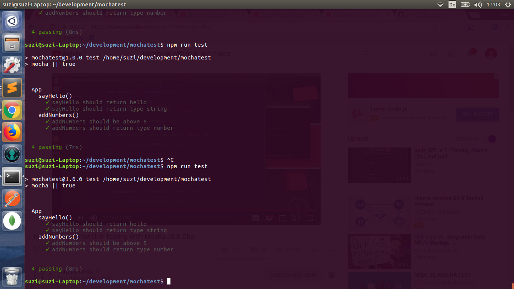

# mochatest
# installation
- create a new folder
- install ``` npm install mocha chai --save-dev```
- install package.json ``` npm init```

- In package.json replace "test"


*  ```
    "scripts": {
    "test": "mocha || true"
  }
  ```




